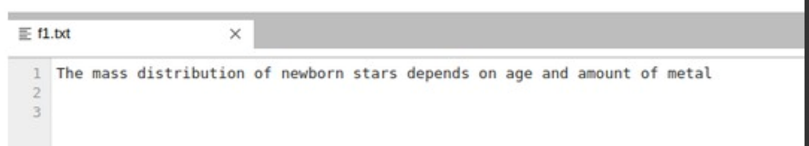

# Word-count
## AIM:
To write a python program for getting the word count from a text.
## EQUIPEMENT'S REQUIRED: 
PC
Anaconda - Python 3.7
## ALGORITHM: 
### Step 1:
Create a file and add some content into it.

### Step 2:
Open file using with keyword/built-in function in read mode.

### Step 3:
Use read() to read the contents of the file.

### Step 4:
Split the lines using split().

### Step 5:
Iterate the list and increment the count

### Step 6:
Print the output

### PROGRAM:
```py
#Program to find number of words
#Developed by: Tejaswini.G
#RegisterNumber:22004187
num = 0
with open('MyFile.txt','r') as f1:
  for i in f1:
    word =i.split()
    num += len(word)
print("NUMBER OF WORDS =",format(num))
```
### OUTPUT:




## RESULT:
Thus the program is written to find the word count from a text.
